---
title: "Báo cáo PBL5 - Thiết bị đeo hỗ trợ phát hiện té ngã và cảnh báo sớm nguy cơ đột quỵ"
lang: vi
---

# BÁO CÁO PBL5 - DỰ ÁN KỸ THUẬT MÁY TÍNH

**Tên đề tài:** Thiết bị đeo hỗ trợ phát hiện té ngã và cảnh báo sớm nguy cơ đột quỵ

**Giảng viên hướng dẫn:** TS. Ninh Khánh Duy

**Sinh viên thực hiện:** Nguyễn Thanh Hiếu, Nguyễn Mạnh Kiên, Huỳnh Ngọc Khánh Linh, Nguyễn Văn Tiến

**Lớp học phần:** 23NH11

**Địa điểm, thời gian:** Đà Nẵng, 06/2025

\newpage

# TÓM TẮT ĐỒ ÁN

Đồ án xây dựng một thiết bị đeo hỗ trợ phát hiện té ngã và cảnh báo sớm nguy cơ bất thường sinh hiệu cho người dùng. Hệ thống sử dụng ESP32-C3 làm bộ điều khiển trung tâm, MPU6050 để thu tín hiệu gia tốc và con quay hồi chuyển, MAX30102 để theo dõi nhịp tim, đồng thời tích hợp buzzer để cảnh báo tại chỗ. Dữ liệu cảm biến được lấy mẫu theo cửa sổ thời gian, truyền về máy chủ bằng CoAP/HTTP và được xử lý bằng mô hình học máy Gradient Boosting. Nhóm tự xây dựng tập dữ liệu té ngã và hoạt động hằng ngày do các tập dữ liệu công khai không đồng nhất với phần cứng, tần số lấy mẫu và vị trí đeo của prototype. Hệ thống phần mềm gồm máy chủ Node.js, dịch vụ suy luận Flask, website dashboard và ứng dụng Flutter để nhận cảnh báo, xác nhận an toàn hoặc gọi cứu trợ. Kết quả thực nghiệm cho thấy hướng trích xuất đặc trưng kết hợp Gradient Boosting đạt hiệu quả tốt và phù hợp để triển khai trong thiết bị thử nghiệm.

\newpage

# BẢNG PHÂN CÔNG NHIỆM VỤ

Bảng 1. Phân công nhiệm vụ của các thành viên trong nhóm

| Sinh viên thực hiện | Nhiệm vụ | Đánh giá |
|---|---|---|
| Nguyễn Thanh Hiếu | Huấn luyện mô hình nhận diện té ngã; lập trình FSM cảnh báo tại chỗ; thiết kế sơ đồ nguyên lý; thu thập và gán nhãn mẫu té ngã. | Hoàn thành |
| Nguyễn Mạnh Kiên | Xây dựng server nhận dữ liệu CoAP/HTTP; lắp ráp và thử nghiệm sản phẩm; lập trình truyền dữ liệu ESP32 lên máy chủ; thu thập dữ liệu. | Hoàn thành |
| Huỳnh Ngọc Khánh Linh | Viết kịch bản thu dữ liệu; tiền xử lý dữ liệu thô; loại bỏ nhiễu; trích xuất đặc trưng; chuẩn hóa định dạng; lập trình bộ lọc trên vi điều khiển. | Hoàn thành |
| Nguyễn Văn Tiến | Phát triển ứng dụng Flutter; thiết kế giao diện và luồng phản hồi; xử lý phản hồi từ app về thiết bị/server; kiểm tra tương tác với ứng dụng. | Hoàn thành |

\newpage

# MỤC LỤC

1. Giới thiệu  
2. Giải pháp  
3. Kết quả  
4. Kết luận  
5. Danh mục tài liệu tham khảo

# DANH SÁCH HÌNH

Hình 1. Kiến trúc IoT tổng thể của hệ thống  
Hình 2. MPU6050  
Hình 3. MAX30102  
Hình 4. Khối nguồn của thiết bị  
Hình 5. Thiết bị prototype  
Hình 6. Thiết bị khi đeo trên tay  
Hình 7. Thông số thiết bị  
Hình 8. Flow FSM cảnh báo té ngã tại chỗ  
Hình 9. Quy trình tiền xử lý dữ liệu  
Hình 10. Pipeline huấn luyện LOSO  
Hình 11. So sánh kết quả các mô hình  
Hình 12. Website dashboard  
Hình 13. Màn hình cảnh báo app Flutter  
Hình 14. Màn hình người thân nhận cảnh báo

# DANH SÁCH BẢNG

Bảng 1. Phân công nhiệm vụ  
Bảng 2. Danh sách linh kiện  
Bảng 3. Bảng chi phí linh kiện  
Bảng 4. Dataset công khai đã khảo sát  
Bảng 5. Nhóm hoạt động trong kịch bản thu dữ liệu  
Bảng 6. Nhóm đặc trưng sử dụng cho mô hình học máy  
Bảng 7. Thông số mô hình Hist-Gradient Boosting triển khai  
Bảng 8. API chính của server  
Bảng 9. Kết quả phần cứng và truyền thông  
Bảng 10. Phân bố dữ liệu tự thu  
Bảng 11. Dữ liệu sau tiền xử lý  
Bảng 12. Kết quả CNN + LSTM + Multi-Head Attention  
Bảng 13. Kết quả Random Forest và Hist-Gradient Boosting  
Bảng 14. Lý do chọn Gradient Boosting  
Bảng 15. Kết quả website dashboard  
Bảng 16. Kết quả app Flutter  
Bảng 17. Kiểm thử tích hợp hệ thống  
Bảng 18. Đánh giá sản phẩm so với yêu cầu đặt ra

\newpage

# 1. GIỚI THIỆU

Té ngã là một trong những tình huống nguy hiểm thường gặp ở người cao tuổi, người có bệnh nền hoặc người sống một mình. Khi người dùng té ngã và không thể tự gọi hỗ trợ, thời gian phát hiện sự cố và gửi cảnh báo có ảnh hưởng trực tiếp đến khả năng được can thiệp kịp thời. Bên cạnh phát hiện té ngã, việc theo dõi nhịp tim cũng có ý nghĩa trong việc quan sát trạng thái sinh hiệu bất thường, đặc biệt trong các tình huống người dùng bị choáng, mất thăng bằng hoặc cần hỗ trợ khẩn cấp.

Trên thế giới, nhiều thiết bị đeo thương mại như đồng hồ thông minh, vòng tay sức khỏe và hệ thống giám sát người cao tuổi đã tích hợp cảm biến chuyển động, cảm biến sinh hiệu và cơ chế gửi cảnh báo đến người thân. Các sản phẩm này có ưu điểm về độ hoàn thiện, hệ sinh thái phần mềm và trải nghiệm người dùng. Tuy nhiên, chi phí thiết bị còn cao, thuật toán thường không công khai, khả năng tùy biến thấp và dữ liệu huấn luyện không nhất thiết phù hợp với một hệ thống tự chế dùng vi điều khiển giá rẻ. Ở Việt Nam, các giải pháp phổ biến vẫn chủ yếu là camera giám sát, nút gọi khẩn cấp hoặc ứng dụng di động, trong khi thiết bị đeo tự động phát hiện té ngã bằng cảm biến quán tính và gửi cảnh báo realtime vẫn còn nhiều dư địa phát triển.

Về mặt nghiên cứu, bài toán phát hiện té ngã thường được tiếp cận theo hai hướng. Hướng thứ nhất sử dụng các ngưỡng vật lý và máy trạng thái hữu hạn để phát hiện các pha đặc trưng của một cú ngã, gồm rơi tự do, va chạm và trạng thái ít cử động sau va chạm. Hướng thứ hai sử dụng học máy hoặc học sâu để học đặc trưng từ dữ liệu cảm biến. Nhóm tham khảo các nghiên cứu về FSM, LSTM-CNN, truyền thông CoAP trong IoT và tối ưu siêu tham số [1]-[4], sau đó xây dựng giải pháp phù hợp với phần cứng ESP32-C3 và dữ liệu tự thu.

Đồ án đề xuất một thiết bị đeo gồm ESP32-C3, cảm biến IMU MPU6050, cảm biến nhịp tim MAX30102, pin LiPo 3.7V, mạch sạc TP4056, mạch tăng áp MT3608 và buzzer cảnh báo tại chỗ. Thiết bị đọc tín hiệu cảm biến, xử lý sơ bộ, chạy FSM để phản ứng nhanh tại chỗ và truyền dữ liệu lên server qua CoAP/HTTP. Server gọi dịch vụ ML để suy luận bằng mô hình Gradient Boosting, đồng thời phát cảnh báo đến website dashboard và app Flutter. Người dùng hoặc người thân có thể xác nhận an toàn, nhận cảnh báo hoặc chuyển sang luồng gọi cứu trợ.

# 2. GIẢI PHÁP

## 2.1. Giải pháp phần cứng và truyền thông

### 2.1.1. Kiến trúc tổng thể thiết bị IoT

Hệ thống được thiết kế theo kiến trúc IoT gồm ba lớp: lớp thiết bị đeo, lớp server xử lý dữ liệu và lớp ứng dụng người dùng. Lớp thiết bị đeo đảm nhiệm thu thập tín hiệu và cảnh báo nhanh tại chỗ. Lớp server tiếp nhận dữ liệu, gọi mô hình AI và quản lý sự kiện. Lớp ứng dụng gồm website dashboard và app Flutter để hiển thị trạng thái, nhận cảnh báo và gửi phản hồi.

[TODO: bổ sung sơ đồ khối tổng thể vào `../images-report/system-iot-block-diagram.png`]

```text
MPU6050 + MAX30102
        |
        v
ESP32-C3 trên thiết bị đeo
        |
        +--> FSM + buzzer cảnh báo tại chỗ
        |
        +--> CoAP/HTTP sensor batch
                |
                v
        Node.js server
                |
                +--> Flask ML service: Gradient Boosting
                |
                +--> Website dashboard realtime
                |
                +--> App Flutter cảnh báo và phản hồi
```

Kiến trúc trên thể hiện rõ tính IoT của hệ thống: cảm biến được đặt trên thiết bị đeo, dữ liệu được truyền qua mạng không dây, server xử lý và lưu trạng thái, còn người dùng tương tác thông qua ứng dụng. Cách tách các khối như vậy giúp thiết bị gọn nhẹ, trong khi phần suy luận và lưu trữ có thể được mở rộng ở server.

### 2.1.2. Khối cảm biến

MPU6050 là cảm biến chính dùng để nhận diện chuyển động. Cảm biến này cung cấp gia tốc ba trục và vận tốc góc ba trục, tương ứng với sáu kênh tín hiệu `ax`, `ay`, `az`, `gx`, `gy`, `gz`. Các tín hiệu này phản ánh trạng thái vận động của cổ tay, từ đó giúp mô hình phân biệt hoạt động bình thường và té ngã.

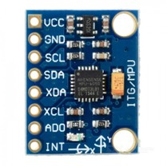

MAX30102 được sử dụng để theo dõi nhịp tim. Cảm biến hoạt động dựa trên nguyên lý quang học: LED đỏ và LED hồng ngoại phát ánh sáng vào vùng tiếp xúc, photodiode thu ánh sáng phản xạ, sau đó tín hiệu biến thiên được dùng để ước lượng nhịp tim. Trong hệ thống, nhịp tim đóng vai trò sinh hiệu bổ sung cho luồng cảnh báo, giúp app hiển thị trạng thái người dùng khi có sự kiện bất thường.

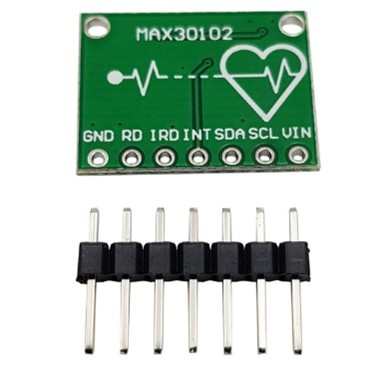

[TODO: bổ sung sơ đồ nối chân cảm biến vào `../images-report/sensor-wiring-diagram.png`]

### 2.1.3. Khối nguồn

Thiết bị sử dụng pin LiPo 3.7V 2000mAh để đáp ứng yêu cầu di động. Module TP4056 đảm nhiệm sạc pin một cell LiPo, trong khi MT3608 tăng áp và ổn định nguồn cấp cho ESP32-C3, cảm biến và buzzer.

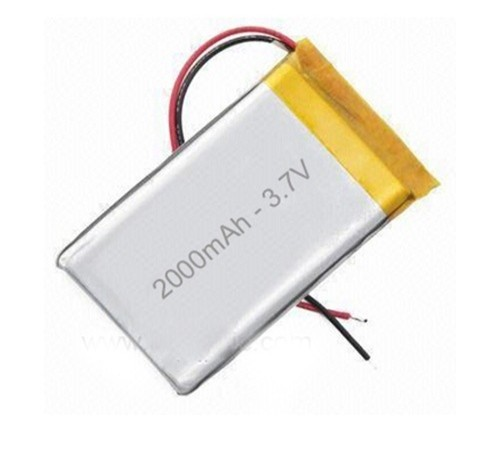

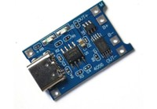

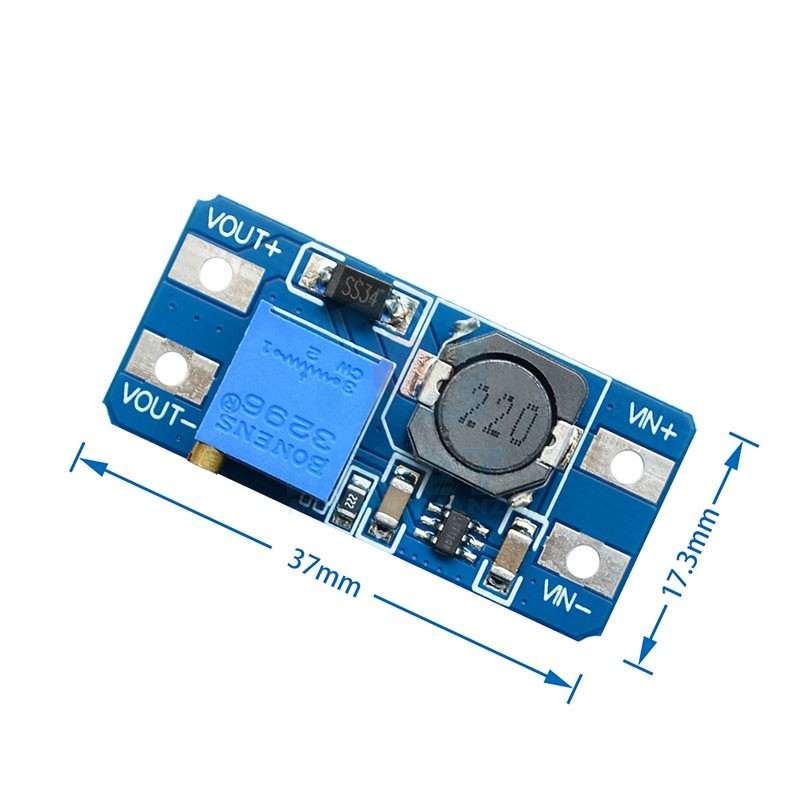

Luồng cấp nguồn của thiết bị:

```text
Pin LiPo 3.7V 2000mAh
        |
        +--> TP4056: sạc pin
        |
        +--> MT3608: tăng áp/ổn định nguồn
                |
                +--> ESP32-C3
                +--> MPU6050
                +--> MAX30102
                +--> Buzzer
```

[TODO: bổ sung sơ đồ mạch nguồn vào `../images-report/power-circuit-diagram.png`]

### 2.1.4. Sơ đồ nguyên lý và lắp ráp thiết bị

Sơ đồ nguyên lý của thiết bị được xây dựng theo cấu hình chân trong firmware ESP32. ESP32-C3 đóng vai trò bộ điều khiển trung tâm, sử dụng bus I2C để giao tiếp đồng thời với MPU6050 và MAX30102. Trong firmware, chân `GPIO4` được cấu hình làm `SDA`, chân `GPIO5` được cấu hình làm `SCL`; do đó hai cảm biến được mắc song song trên cùng bus I2C, dùng chung đường dữ liệu, đường clock, nguồn và mass. MAX30102 sử dụng địa chỉ I2C `0x57`, còn MPU6050 được khởi tạo bằng thư viện Adafruit MPU6050 trên bus I2C.

Đường cảnh báo tại chỗ được điều khiển qua `GPIO18`. Chân này xuất tín hiệu PWM để kích buzzer khi FSM xác nhận trạng thái té ngã. Firmware cũng cấu hình `GPIO9` làm nút nhấn với chế độ `INPUT_PULLUP`, dùng để bắt đầu hoặc dừng luồng gửi dữ liệu trong quá trình thử nghiệm. Khi vẽ sơ đồ nguyên lý, nút nhấn có thể được thể hiện như một nhánh điều khiển phụ nối từ `GPIO9` xuống GND.

Khối nguồn gồm pin LiPo 3.7V 2000mAh, module sạc TP4056 và module tăng áp MT3608. Pin LiPo nối vào hai chân `B+` và `B-` của TP4056 để sạc. Đầu ra nguồn từ pin/TP4056 được đưa vào MT3608 để nâng và ổn định điện áp cấp cho ESP32-C3. Từ ESP32-C3, đường `3V3` cấp cho MPU6050 và MAX30102 để đảm bảo mức logic I2C tương thích với vi điều khiển; tất cả module phải nối chung GND. Buzzer được cấp nguồn theo mạch điều khiển phù hợp và nhận tín hiệu điều khiển từ `GPIO18`.

Sơ đồ kết nối phần cứng cần thể hiện các đường chính sau:

| Khối kết nối | Chân/module | Chức năng |
|---|---|---|
| ESP32-C3 `GPIO4` | SDA của MPU6050 và SDA của MAX30102 | Đường dữ liệu I2C dùng chung cho hai cảm biến |
| ESP32-C3 `GPIO5` | SCL của MPU6050 và SCL của MAX30102 | Đường clock I2C dùng chung cho hai cảm biến |
| ESP32-C3 `3V3` | VCC của MPU6050 và MAX30102 | Cấp nguồn logic 3.3V cho cảm biến |
| ESP32-C3 `GND` | GND của MPU6050, MAX30102, MT3608, TP4056 | Mass chung toàn mạch |
| ESP32-C3 `GPIO18` | Chân điều khiển buzzer | Xuất PWM/cảnh báo âm thanh khi phát hiện té ngã |
| ESP32-C3 `GPIO9` | Nút nhấn kéo xuống GND | Điều khiển bắt đầu/dừng thiết bị trong quá trình thử nghiệm |
| Pin LiPo 3.7V | `B+`, `B-` của TP4056 | Nguồn lưu trữ năng lượng và sạc pin |
| TP4056 | Đầu ra pin/nguồn vào MT3608 | Mạch sạc và bảo vệ nguồn pin |
| MT3608 | Đầu ra cấp cho ESP32-C3 | Tăng áp/ổn định nguồn cho thiết bị |

[TODO: bổ sung sơ đồ nguyên lý chính vào `../images-report/hardware-schematic.png`]

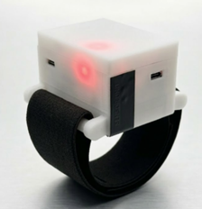

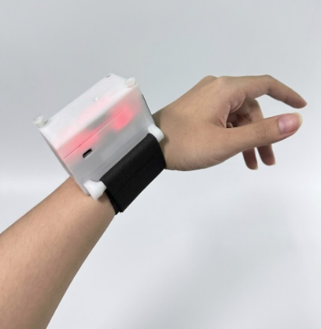

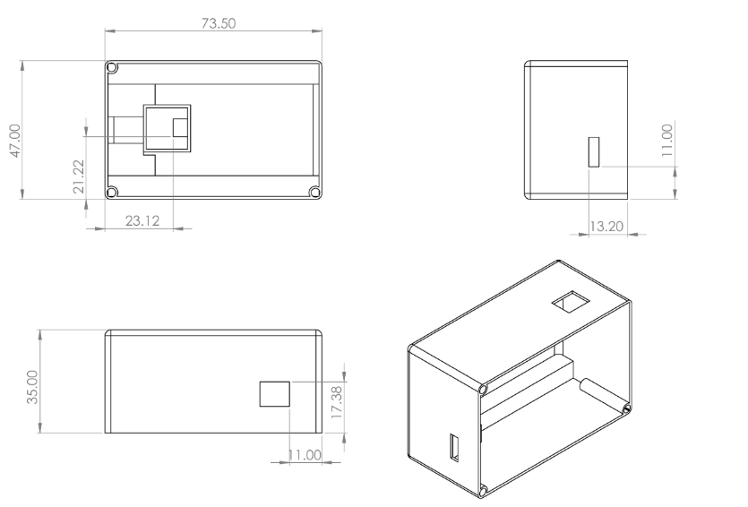

Thiết bị được bố trí theo dạng đeo cổ tay để MPU6050 thu được chuyển động cơ thể trong các kịch bản ngã và hoạt động hằng ngày. Buzzer được đặt trên thiết bị để cảnh báo ngay cả khi điện thoại chưa nhận thông báo. Khối nguồn được tách thành phần sạc và phần tăng áp nhằm đảm bảo thiết bị có thể hoạt động độc lập bằng pin.

### 2.1.5. FSM cảnh báo tại chỗ

FSM được triển khai trên vi điều khiển để phát hiện nhanh các dấu hiệu ngã trước khi dữ liệu được xử lý bởi mô hình AI trên server. Cách tiếp cận này giúp thiết bị có khả năng cảnh báo tại chỗ bằng buzzer, giảm phụ thuộc hoàn toàn vào kết nối mạng.

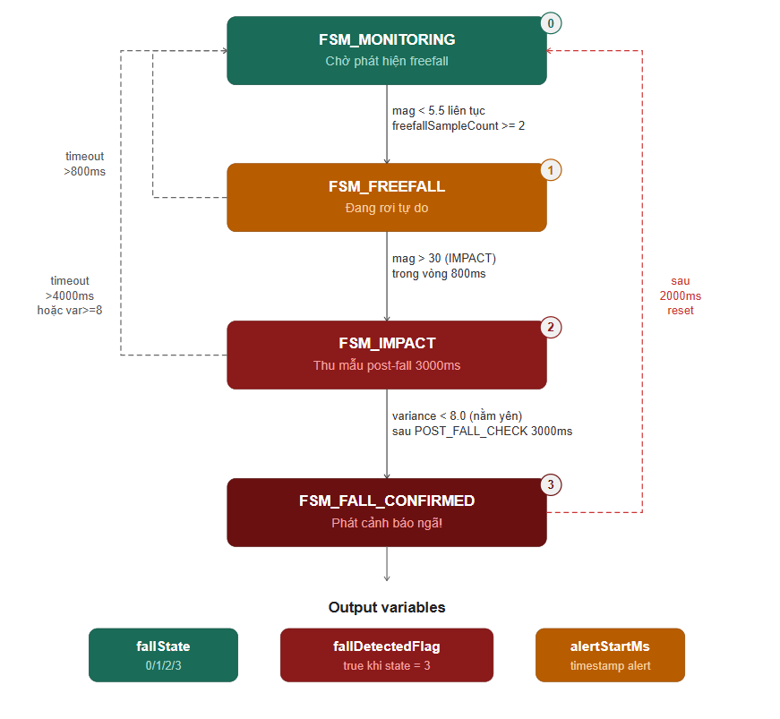

FSM gồm bốn trạng thái chính: `MONITORING`, `FREEFALL`, `IMPACT` và `FALL_CONFIRMED`. Ở trạng thái `MONITORING`, hệ thống liên tục theo dõi độ lớn gia tốc. Khi gia tốc nhỏ hơn `5.5` liên tục ít nhất `2` mẫu, FSM chuyển sang `FREEFALL`, tương ứng với pha mất trọng lượng ngắn trong quá trình té ngã. Nếu trong vòng `800ms` sau đó gia tốc vượt `30`, hệ thống xác định có va chạm và chuyển sang `IMPACT`.

Sau khi vào trạng thái `IMPACT`, hệ thống chờ `3000ms` rồi tính variance của tín hiệu sau va chạm. Nếu variance nhỏ hơn `8.0`, người dùng được xem là đang nằm yên hoặc ít cử động, FSM chuyển sang `FALL_CONFIRMED` và đặt `fallDetectedFlag`. Từ `FALL_CONFIRMED`, hệ thống tự reset về `MONITORING` sau `2000ms` và xóa `fallDetectedFlag`.

Các nhánh fallback được dùng để giảm báo nhầm. Nếu ở `FREEFALL` nhưng không có impact sau `800ms`, FSM quay về `MONITORING`. Nếu ở `IMPACT` nhưng timeout quá `4000ms` hoặc variance lớn hơn hoặc bằng `8.0`, hệ thống xem người dùng vẫn còn cử động và quay về `MONITORING` mà không báo ngã. Output của FSM gồm `fallState` trong khoảng `0-3` và cờ `fallDetectedFlag`.

### 2.1.6. Truyền thông CoAP/HTTP

Trong chế độ triển khai, ESP32-C3 gửi dữ liệu cảm biến lên server bằng CoAP trên UDP. CoAP phù hợp với thiết bị IoT tài nguyên hạn chế vì overhead thấp hơn HTTP, gói tin ngắn hơn và phù hợp với truyền dữ liệu định kỳ từ vi điều khiển. Mỗi gói sensor batch đại diện cho một cửa sổ dữ liệu gồm thông tin gia tốc, con quay, nhịp tim, trạng thái FSM, cờ phát hiện ngã và một số đặc trưng nhanh.

HTTP vẫn được sử dụng ở các phần cần tính linh hoạt cao hơn, gồm dashboard, app Flutter, API kiểm thử, đăng ký thiết bị nhận thông báo và giao tiếp giữa server Node.js với dịch vụ ML Flask. Website dashboard nhận dữ liệu realtime thông qua Socket.IO để hiển thị trạng thái thiết bị, tín hiệu cảm biến và sự kiện cảnh báo.

[TODO: bổ sung sơ đồ giao thức vào `../images-report/coap-http-communication-flow.png`]

```text
ESP32-C3 -- CoAP/UDP sensor batch --> Node.js server
Node.js server -- HTTP /predict --> Flask ML service
Node.js server -- Socket.IO --> Website dashboard
App Flutter -- HTTP API --> Node.js server
Server/App -- Push notification --> Người dùng và người thân
```

### 2.1.7. Linh kiện và chi phí

Bảng 2. Danh sách linh kiện sử dụng trong đồ án

| Linh kiện | Hình ảnh | Tham số kỹ thuật chính | Đầu vào/đầu ra | Nguyên lý hoạt động | Vai trò trong hệ thống |
|---|---|---|---|---|---|
| ESP32-C3 | [TODO: bổ sung ảnh ESP32-C3] | Vi điều khiển 32-bit RISC-V, WiFi 2.4GHz, GPIO/I2C/UART | Nhận tín hiệu I2C; gửi dữ liệu WiFi; điều khiển buzzer | Đọc cảm biến, xử lý cửa sổ, truyền dữ liệu | Bộ điều khiển trung tâm |
| MPU6050 |  | Gia tốc 3 trục, con quay 3 trục, I2C | Đầu vào chuyển động; đầu ra `ax, ay, az, gx, gy, gz` | Đo gia tốc và vận tốc góc | Nguồn dữ liệu chính cho phát hiện té ngã |
| MAX30102 |  | Cảm biến nhịp tim/SpO2 quang học, I2C | Đầu vào tín hiệu quang; đầu ra nhịp tim | Phân tích ánh sáng phản xạ theo nhịp mạch | Theo dõi sinh hiệu |
| TP4056 |  | Module sạc LiPo 1 cell, điện áp sạc 4.2V | Đầu vào 5V; đầu ra sạc pin | Điều khiển sạc pin theo dòng/áp | Sạc pin cho thiết bị |
| Pin LiPo 3.7V 2000mAh |  | Điện áp danh định 3.7V, dung lượng 2000mAh | Đầu ra nguồn DC | Lưu trữ năng lượng | Nguồn di động |
| MT3608 |  | Module tăng áp DC-DC | Đầu vào pin; đầu ra nâng áp | Chuyển mạch DC-DC | Ổn định nguồn cấp |
| Buzzer |  | Còi cảnh báo điều khiển GPIO/PWM | Đầu vào tín hiệu điều khiển; đầu ra âm thanh | Phát âm thanh khi có cảnh báo | Cảnh báo tại chỗ |

Bảng 3. Bảng kê chi phí linh kiện

| Linh kiện | Số lượng | Đơn giá | Thành tiền | Ghi chú |
|---|---:|---:|---:|---|
| ESP32-C3 | 1 |  |  |  |
| MPU6050 | 1 |  |  |  |
| MAX30102 | 1 |  |  |  |
| TP4056 | 1 |  |  |  |
| Pin LiPo 3.7V 2000mAh | 1 |  |  |  |
| MT3608 | 1 |  |  |  |
| Buzzer | 1 |  |  |  |
| Dây nối, công tắc, vỏ, phụ kiện | 1 bộ |  |  |  |
| **Tổng cộng** |  |  |  |  |

## 2.2. Giải pháp AI/KHDL

### 2.2.1. Khảo sát dữ liệu và lý do tự thu

Nhóm khảo sát một số dataset công khai trước khi xây dựng tập dữ liệu riêng. Các dataset này có giá trị tham khảo về kịch bản té ngã và cấu trúc tín hiệu, nhưng không được dùng làm dữ liệu chính vì không đồng nhất với phần cứng, tần số lấy mẫu, vị trí đeo và cách tổ chức pipeline của hệ thống.

Bảng 4. Dataset công khai đã khảo sát

| Dataset | Cảm biến/thiết bị | Nhận xét sử dụng |
|---|---|---|
| WEDA-FALL | Fitbit Sense | Không chọn làm dữ liệu chính do khác thiết bị đo và tần số lấy mẫu. |
| PIF v2 | MPU6050 | Có tính tham khảo vì dùng MPU6050, nhưng kịch bản và định dạng không hoàn toàn khớp pipeline của nhóm. |
| HR_IMU_falldetection_dataset | Thiết bị tự chế | Có giá trị tham khảo cho hướng kết hợp IMU và sinh hiệu, nhưng không đồng nhất phần cứng. |
| BandX-Activity | MPU6050 | Có thể tham khảo hoạt động thường ngày, nhưng nhóm vẫn tự thu để kiểm soát vị trí đeo và nhãn. |

Từ các hạn chế trên, nhóm tự thu dữ liệu bằng chính thiết bị prototype. Cách này giúp dữ liệu huấn luyện phản ánh đúng đặc tính cảm biến, cách đeo, tần số lấy mẫu và nhiễu thực tế của hệ thống.

### 2.2.2. Kịch bản thu dữ liệu và gán nhãn

Dữ liệu được chia thành hai nhóm chính: hoạt động bình thường và té ngã. Nhãn `0` biểu diễn hoạt động bình thường, nhãn `1` biểu diễn té ngã.

Bảng 5. Nhóm hoạt động trong kịch bản thu dữ liệu

| Nhóm dữ liệu | Hoạt động/kịch bản | Mục đích |
|---|---|---|
| Normal | Đi bộ, chạy chậm, gõ phím, lướt điện thoại, hoạt động sinh hoạt hằng ngày | Giúp mô hình học các chuyển động không nguy hiểm và giảm báo nhầm |
| Fall | Ngã ra trước, ngã ra sau, ngã khi đang di chuyển | Giúp mô hình học đặc trưng rơi tự do, va chạm và trạng thái sau va chạm |

[TODO: bổ sung ảnh kịch bản thu dữ liệu vào `../images-report/data-collection-scenarios.png`]

### 2.2.3. Tiền xử lý dữ liệu

Dữ liệu thô từ cảm biến cần được xử lý trước khi đưa vào mô hình. Pipeline tiền xử lý gồm kiểm tra file rỗng hoặc sai định dạng, loại bỏ giá trị không hợp lệ, lọc nhiễu, chia cửa sổ 100 mẫu và chuẩn hóa dữ liệu. Cửa sổ 100 mẫu tương ứng 2 giây ở tần số 50Hz, đủ để bao phủ các pha quan trọng của một cú ngã.

Đối với tín hiệu cảm biến quán tính, nhiễu tức thời có thể làm gia tốc hoặc vận tốc góc dao động mạnh trong thời gian rất ngắn. Nhóm sử dụng bộ lọc Kalman để làm mượt tín hiệu trước khi chia cửa sổ và trích xuất đặc trưng. Bộ lọc Kalman phù hợp với bài toán này vì nó kết hợp giá trị đo hiện tại với ước lượng trước đó, từ đó giảm nhiễu ngẫu nhiên nhưng vẫn giữ được xu hướng thay đổi của chuyển động.

Với một kênh tín hiệu cảm biến, gọi `z_k` là giá trị đo tại thời điểm `k`, `\hat{x}_{k|k}` là giá trị đã lọc và `P` là độ bất định của ước lượng. Bước dự đoán được viết như sau:

$$\hat{x}_{k|k-1} = \hat{x}_{k-1|k-1}$$

$$P_{k|k-1} = P_{k-1|k-1} + Q$$

Trong đó `Q` biểu diễn nhiễu quá trình. Sau khi có giá trị đo mới, hệ số Kalman được tính bằng:

$$K_k = \frac{P_{k|k-1}}{P_{k|k-1} + R}$$

Trong đó `R` biểu diễn nhiễu đo của cảm biến. Giá trị tín hiệu sau lọc được cập nhật theo công thức:

$$\hat{x}_{k|k} = \hat{x}_{k|k-1} + K_k(z_k - \hat{x}_{k|k-1})$$

$$P_{k|k} = (1 - K_k)P_{k|k-1}$$

Nếu giá trị đo dao động bất thường trong thời gian rất ngắn, bộ lọc không thay đổi ước lượng quá mạnh theo nhiễu đó. Ngược lại, khi tín hiệu thay đổi ổn định qua nhiều mẫu liên tiếp, ước lượng sẽ dịch chuyển theo xu hướng mới. Cách xử lý này giúp giảm nhiễu cảm biến nhưng không làm mất hoàn toàn các biến thiên quan trọng quanh thời điểm rơi và va chạm.

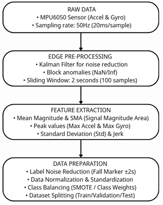

Với dữ liệu té ngã, nhóm ưu tiên giữ các cửa sổ chứa giai đoạn rơi, va chạm và thời điểm ngay sau va chạm. Các cửa sổ nằm yên quá lâu sau ngã có thể làm nhiễu nhãn vì tín hiệu giống trạng thái ít vận động bình thường.

### 2.2.4. Trích xuất đặc trưng

Sau khi chia cửa sổ, nhóm trích xuất 10 nhóm đặc trưng thống kê và miền tần số trên từng trục tín hiệu. Các nhóm này được tính cho 6 trục `ax`, `ay`, `az`, `gx`, `gy`, `gz`; sau đó bổ sung đặc trưng từ độ lớn gia tốc tổng hợp SMV. Vì vậy, dù báo cáo mô tả 10 nhóm đặc trưng chính, vector đầu vào cuối cùng của mô hình có 62 chiều.

Bảng 6. Nhóm đặc trưng sử dụng cho mô hình học máy

| Nhóm đặc trưng | Ý nghĩa |
|---|---|
| Variance | Độ phân tán của tín hiệu trong cửa sổ |
| Standard deviation | Mức biến thiên chuẩn |
| Mean | Giá trị trung bình |
| Median | Trung vị, giảm ảnh hưởng ngoại lai |
| Max | Giá trị cực đại |
| Min | Giá trị cực tiểu |
| Delta | Biên độ dao động giữa max và min |
| PSD | Công suất phổ trung bình |
| PSE | Entropy phổ |
| Skewness | Độ lệch phân phối tín hiệu |
| SMV skewness và SMV jerk peak | Đặc trưng bổ sung từ độ lớn gia tốc tổng hợp |

Để tổng hợp ba trục gia tốc thành một đại lượng biểu diễn cường độ chuyển động, nhóm sử dụng độ lớn vector gia tốc:

$$SMV = \sqrt{a_x^2 + a_y^2 + a_z^2}$$

Trong đó `a_x`, `a_y`, `a_z` là gia tốc theo ba trục. SMV giúp mô hình nhận biết các pha có gia tốc tổng hợp tăng mạnh, thường xuất hiện khi va chạm.

SMA được dùng để mô tả mức độ hoạt động trong một cửa sổ thời gian:

$$SMA = \frac{1}{N}\sum_{i=1}^{N}(|a_x(i)| + |a_y(i)| + |a_z(i)|)$$

Giá trị SMA cao cho thấy cửa sổ có nhiều dao động hoặc chuyển động mạnh. Ngược lại, SMA thấp thường xuất hiện khi người dùng đứng yên hoặc nằm yên.

Jerk peak được dùng để bắt sự thay đổi đột ngột của độ lớn gia tốc:

$$Jerk(i) = \frac{|SMV(i) - SMV(i-1)|}{\Delta t}$$

Trong bài toán té ngã, jerk cao thường xuất hiện quanh thời điểm va chạm. Đặc trưng này giúp phân biệt các chuyển động sinh hoạt chậm với cú ngã có biến thiên gia tốc đột ngột.

Trước khi đưa đặc trưng vào mô hình, dữ liệu được chuẩn hóa để các chiều có thang đo tương đồng:

$$z = \frac{x - \mu}{\sigma}$$

Trong đó `x` là giá trị đặc trưng ban đầu, `\mu` là trung bình và `\sigma` là độ lệch chuẩn tính trên tập huấn luyện. Việc chuẩn hóa giúp mô hình học ổn định hơn và tránh đặc trưng có thang đo lớn chi phối quá trình huấn luyện.

### 2.2.5. Pipeline huấn luyện LOSO

Để đánh giá khả năng tổng quát hóa theo người dùng, nhóm sử dụng Leave-One-Subject-Out (LOSO). Ở mỗi fold, toàn bộ dữ liệu của một người được giữ làm tập kiểm thử, dữ liệu của các người còn lại được dùng để huấn luyện và tối ưu siêu tham số.

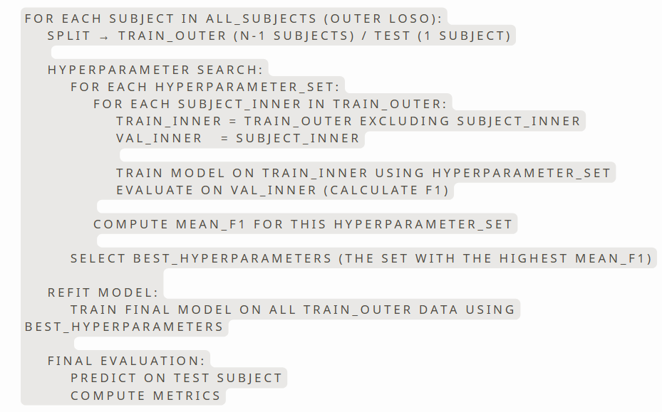

Quy trình huấn luyện:

```text
Self-collected data -> preprocessing -> windowing -> feature extraction
-> LOSO split -> hyperparameter tuning -> evaluation -> deployment model
```

LOSO phù hợp hơn chia ngẫu nhiên theo window vì dữ liệu cảm biến có cửa sổ chồng lấn. Nếu chia ngẫu nhiên, các cửa sổ gần nhau của cùng một người có thể xuất hiện ở cả train và test, làm kết quả đánh giá lạc quan hơn thực tế. LOSO buộc mô hình kiểm thử trên người chưa xuất hiện trong tập huấn luyện, do đó phản ánh tốt hơn tình huống triển khai với người dùng mới.

### 2.2.6. Mô hình thử nghiệm và lựa chọn triển khai

Nhóm thử nghiệm hai hướng chính. Hướng thứ nhất huấn luyện end-to-end bằng CNN + LSTM + Multi-Head Attention trên chuỗi dữ liệu 100 mẫu. Hướng này khai thác trực tiếp quan hệ thời gian trong tín hiệu, nhưng chi phí tính toán và triển khai cao hơn. Hướng thứ hai trích xuất đặc trưng rồi huấn luyện các mô hình học máy trên vector đặc trưng 62 chiều, gồm Random Forest và Gradient Boosting.

Với hướng feature-based, nhóm thực hiện tối ưu siêu tham số trong từng fold LOSO. Không gian tìm kiếm của Gradient Boosting gồm `max_iter = {100, 200, 300}`, `learning_rate = {0.05, 0.1, 0.2}`, `max_depth = {3, 5, 7}`, `min_samples_leaf = {2, 4}` và `l2_regularization = {0.0, 0.1, 1.0}`. Sau quá trình đánh giá, mô hình triển khai cuối cùng sử dụng Hist-Gradient Boosting, một biến thể Gradient Boosting phù hợp với dữ liệu dạng bảng sau khi trích xuất đặc trưng.

Bảng 7. Thông số mô hình Hist-Gradient Boosting triển khai

| Thành phần | Giá trị sử dụng | Ý nghĩa trong mô hình |
|---|---:|---|
| Thuật toán | Hist-Gradient Boosting | Huấn luyện nhiều cây quyết định tuần tự, mỗi cây mới sửa lỗi của các cây trước đó. |
| Đầu vào | 62 đặc trưng | Vector đặc trưng được trích xuất từ cửa sổ 100 mẫu của 6 trục IMU và đặc trưng SMV. |
| Chuẩn hóa | StandardScaler | Chuẩn hóa đặc trưng theo trung bình và độ lệch chuẩn của tập huấn luyện. |
| `max_iter` | 200 | Số vòng boosting tối đa; tương ứng số cây được thêm tuần tự vào mô hình. |
| `learning_rate` | 0.2 | Mức đóng góp của từng cây; giá trị này giúp mô hình học đủ nhanh nhưng vẫn kiểm soát dao động. |
| `max_depth` | 3 | Giới hạn độ sâu mỗi cây để tránh mô hình học quá chi tiết trên từng người trong tập huấn luyện. |
| `min_samples_leaf` | 4 | Yêu cầu mỗi nút lá có tối thiểu 4 mẫu, giúp quyết định của cây ổn định hơn. |
| `l2_regularization` | 0.0 | Không áp dụng regularization L2 trong cấu hình cuối cùng vì kết quả LOSO không cải thiện khi tăng hệ số này. |
| `random_state` | 42 | Cố định seed để kết quả huấn luyện có thể tái lập. |
| Ngưỡng phân loại | 0.4742 | Nếu xác suất Fall lớn hơn hoặc bằng ngưỡng này, cửa sổ được phân loại là té ngã. |
| Phương pháp đánh giá | LOSO | Mỗi fold giữ một người làm test, các người còn lại dùng để train và tuning. |

Kết quả thực nghiệm cho thấy Gradient Boosting đạt hiệu quả tốt hơn Random Forest ở các chỉ số F1, recall, precision và AUC, đồng thời có FAR và MDR thấp hơn. Mô hình này cũng phù hợp với pipeline triển khai vì đầu vào là vector đặc trưng có kích thước cố định, suy luận nhanh và dễ đóng gói thành file mô hình phục vụ Flask ML service. Vì mục tiêu của hệ thống là giảm bỏ sót té ngã và hạn chế báo động giả, nhóm chọn Gradient Boosting làm mô hình triển khai chính.

### 2.2.7. Loss function của mô hình

Vì bài toán được mô hình hóa dưới dạng phân loại nhị phân, với `0 = Normal` và `1 = Fall`, mô hình Hist-Gradient Boosting sử dụng log loss, còn gọi là binary cross-entropy, làm hàm mất mát trong quá trình huấn luyện. Hàm mất mát này phù hợp vì mô hình không chỉ cần đưa ra nhãn cuối cùng, mà còn cần ước lượng xác suất một cửa sổ dữ liệu thuộc lớp té ngã.

Gọi `y_i \in \{0,1\}` là nhãn thật của mẫu thứ `i`, `\hat{p}_i` là xác suất mô hình dự đoán mẫu đó thuộc lớp Fall. Log loss của một mẫu được tính như sau:

$$\mathcal{L}(y_i, \hat{p}_i) = -\left[y_i\log(\hat{p}_i) + (1-y_i)\log(1-\hat{p}_i)\right]$$

Với toàn bộ tập huấn luyện gồm `N` mẫu, hàm mục tiêu là trung bình log loss:

$$\mathcal{J} = \frac{1}{N}\sum_{i=1}^{N}\mathcal{L}(y_i, \hat{p}_i)$$

Khi mẫu thật là Fall (`y_i = 1`), mô hình bị phạt mạnh nếu dự đoán xác suất Fall thấp. Khi mẫu thật là Normal (`y_i = 0`), mô hình bị phạt mạnh nếu dự đoán xác suất Fall cao. Đặc điểm này phù hợp với hệ thống cảnh báo vì cả bỏ sót té ngã và báo nhầm đều cần được kiểm soát.

Trong Gradient Boosting, mô hình được xây dựng theo dạng cộng dồn nhiều cây quyết định. Ở vòng lặp thứ `m`, mô hình mới được cập nhật theo công thức:

$$F_m(x) = F_{m-1}(x) + \eta h_m(x)$$

Trong đó `h_m(x)` là cây quyết định được huấn luyện để giảm phần lỗi còn lại của mô hình trước đó, còn `\eta` là learning rate. Với cấu hình triển khai, nhóm sử dụng `learning_rate = 0.2`, tức mỗi cây mới đóng góp một phần có kiểm soát vào mô hình tổng. Xác suất lớp Fall được suy ra từ đầu ra của mô hình thông qua hàm sigmoid:

$$\hat{p} = \frac{1}{1 + e^{-F(x)}}$$

Ngưỡng phân loại cuối cùng được đặt là `0.4742`. Khi `\hat{p} \ge 0.4742`, cửa sổ dữ liệu được phân loại là Fall; ngược lại được phân loại là Normal.

### 2.2.8. Tiêu chí đánh giá

Precision cho biết trong các lần hệ thống báo té ngã, có bao nhiêu lần là đúng:

$$Precision = \frac{TP}{TP + FP}$$

Recall cho biết trong các lần té ngã thật, hệ thống phát hiện được bao nhiêu lần:

$$Recall = \frac{TP}{TP + FN}$$

F1-score cân bằng giữa precision và recall, phù hợp khi cần đánh giá tổng thể mô hình:

$$F1 = 2 \times \frac{Precision \times Recall}{Precision + Recall}$$

False Alarm Rate đo tỉ lệ báo nhầm trên các trường hợp không té ngã:

$$FAR = \frac{FP}{FP + TN}$$

Miss Detection Rate đo tỉ lệ bỏ sót trên các trường hợp té ngã thật:

$$MDR = \frac{FN}{FN + TP}$$

Trong bài toán phát hiện té ngã, recall và MDR có ý nghĩa đặc biệt quan trọng vì bỏ sót té ngã có thể khiến người dùng không được hỗ trợ kịp thời. Tuy nhiên, FAR cũng cần được kiểm soát để hệ thống không gây quá nhiều cảnh báo giả.

## 2.3. Giải pháp phần mềm

### 2.3.1. Kiến trúc phần mềm

Phần mềm của hệ thống gồm Node.js server, Flask ML service, website dashboard và app Flutter. Server Node.js là trung tâm điều phối, nhận dữ liệu từ thiết bị, gọi mô hình AI, lưu lịch sử và phát cảnh báo. Flask ML service tách riêng logic suy luận để mô hình được nạp một lần và tái sử dụng cho nhiều request. Website dashboard phục vụ giám sát trong quá trình thử nghiệm, còn app Flutter phục vụ người dùng cuối và người thân.

[TODO: bổ sung kiến trúc phần mềm vào `../images-report/software-architecture.png`]

### 2.3.2. Server và API

Server nhận sensor batch từ ESP32-C3, kiểm tra payload, cập nhật trạng thái thiết bị, gọi ML service và ghi nhận sự kiện té ngã. Khi có cảnh báo, server phát realtime event cho dashboard, gửi thông báo đến app và chờ phản hồi từ người dùng hoặc người thân.

Bảng 8. API chính của server

| API | Phương thức | Vai trò |
|---|---|---|
| `/api/sensor-batch` | POST | Nhận cửa sổ dữ liệu cảm biến từ ESP32 |
| `/api/register-device` | POST | Đăng ký thiết bị di động nhận cảnh báo |
| `/api/fall-history` | GET | Trả về lịch sử sự kiện té ngã |
| `/api/device/status` | GET | Trả về trạng thái kết nối và thông tin mới nhất |
| `/api/fall-response` | POST | Nhận phản hồi xác nhận/cảnh báo từ app |
| `/api/fall-escalation` | POST | Kích hoạt luồng leo thang cảnh báo |
| `/api/comm/call` | POST | Kích hoạt kịch bản gọi cứu trợ |
| `/api/comm/sms` | POST | Kích hoạt kịch bản gửi tin nhắn |

### 2.3.3. Website dashboard

Website dashboard hiển thị dữ liệu realtime, trạng thái kết nối, nhịp tim, kết quả mô hình và lịch sử cảnh báo. Dashboard giúp nhóm quan sát trực tiếp quá trình thu dữ liệu, kiểm tra thiết bị và xác nhận luồng truyền dữ liệu trong quá trình thử nghiệm.

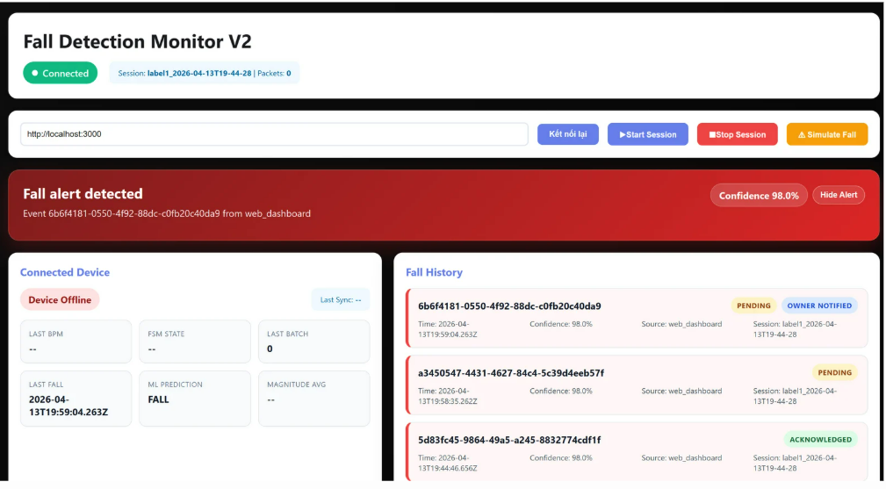

### 2.3.4. App Flutter

Ứng dụng Flutter là giao diện phản hồi khẩn cấp cho người dùng và người thân. Khi server xác nhận sự kiện té ngã, app hiển thị cảnh báo, cho phép người dùng xác nhận an toàn hoặc chuyển sang gọi cứu trợ. Người thân cũng nhận được cảnh báo để theo dõi và phản hồi khi cần.

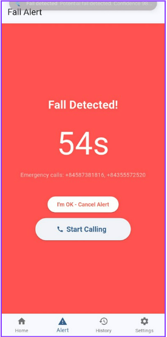

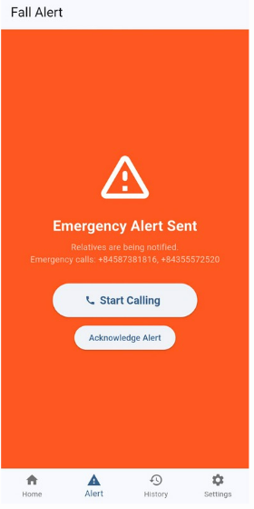

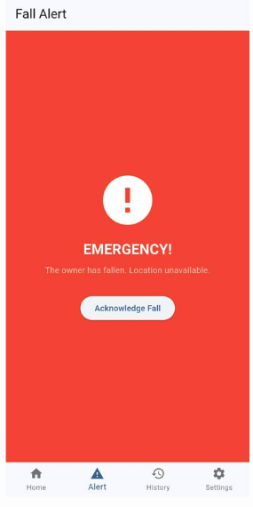

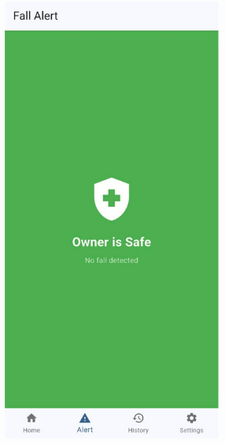

### 2.3.5. Luồng cảnh báo end-to-end

Luồng cảnh báo end-to-end bắt đầu từ thiết bị đeo và kết thúc khi server nhận được phản hồi từ người dùng hoặc người thân:

```text
Fall detected
        |
        v
Server creates fall event
        |
        v
App receives alert
        |
        +--> User confirms safe
        |
        +--> User/relative calls help
        |
        v
Server updates event status
```

# 3. KẾT QUẢ

## 3.1. Kết quả phần cứng và truyền thông

Bảng 9. Kết quả phần cứng và truyền thông

| Hạng mục | Kết quả | Minh chứng |
|---|---|---|
| Lắp ráp prototype | Thiết bị đeo đã được lắp ráp với ESP32-C3, MPU6050, MAX30102, nguồn và buzzer | `hinh-anh-thiet-bi.png`, `deo-thiet-bi.png` |
| MPU6050 | Thu được gia tốc và con quay 3 trục ở tần số 50Hz | Dữ liệu CSV và dashboard |
| MAX30102 | Theo dõi nhịp tim để hiển thị sinh hiệu trên app/dashboard | Ảnh cảm biến và giao diện app |
| FSM + buzzer | Thiết bị có cảnh báo tại chỗ khi FSM xác nhận nguy cơ té ngã | `fsm-flow.png`, `buzzer.jpg` |
| CoAP/HTTP | Thiết bị gửi batch dữ liệu lên server; server phục vụ dashboard/app qua HTTP và Socket.IO | API server và dashboard |
| Nguồn | Thiết bị sử dụng pin LiPo, TP4056 và MT3608 để hoạt động độc lập | Ảnh linh kiện nguồn |

## 3.2. Kết quả AI/KHDL

Bảng 10. Phân bố dữ liệu tự thu theo người tham gia

| Người tham gia | Normal sessions | Fall sessions | Tổng sessions |
|---|---:|---:|---:|
| An | 50 | 50 | 100 |
| Cong | 52 | 60 | 112 |
| Hao | 52 | 50 | 102 |
| Hieu | 50 | 51 | 101 |
| Kien | 45 | 36 | 81 |
| Quan | 51 | 50 | 101 |
| Tien | 52 | 50 | 102 |
| **Tổng** | **352** | **347** | **699** |

Bảng 11. Thống kê dữ liệu sau tiền xử lý

| Chỉ tiêu | Giá trị |
|---|---:|
| Số người tham gia | 7 |
| Tổng số sessions hợp lệ | 699 |
| Normal windows | 1509 |
| Fall windows sau tinh chỉnh nhãn | 1712 |
| Tổng số windows | 3221 |
| Tần số lấy mẫu | 50Hz |
| Kích thước cửa sổ | 100 mẫu, tương ứng 2 giây |
| Số kênh tín hiệu | 6 |

Bảng 12. Kết quả LOSO của mô hình CNN + LSTM + Multi-Head Attention

| Subject | F1 | Recall | Precision | AUC-ROC | FN | FP | Threshold |
|---|---:|---:|---:|---:|---:|---:|---:|
| An | 0.9214 | 0.8719 | 0.9769 | 0.9867 | 31 | 5 | 0.445 |
| Cong | 0.9730 | 0.9600 | 0.9863 | 0.9949 | 12 | 4 | 0.568 |
| Hao | 0.8935 | 0.8629 | 0.9264 | 0.9463 | 34 | 17 | 0.514 |
| Hieu | 0.9264 | 0.9373 | 0.9157 | 0.9853 | 16 | 22 | 0.420 |
| Kien | 0.9326 | 0.9651 | 0.9022 | 0.9761 | 6 | 18 | 0.602 |
| Quan | 0.8602 | 0.9677 | 0.7742 | 0.9557 | 8 | 70 | 0.615 |
| Tien | 0.9144 | 0.9514 | 0.8801 | 0.9703 | 12 | 32 | 0.701 |
| **Mean** | **0.9174** | **0.9309** | **0.9088** | **0.9736** |  |  | **0.552** |

Bảng 13. Kết quả tổng hợp Random Forest và Hist-Gradient Boosting

| Mô hình | Mean F1 | Mean Recall | Mean Precision | Mean AUC | FAR | MDR | Threshold triển khai |
|---|---:|---:|---:|---:|---:|---:|---:|
| Random Forest | 0.9521 | 0.9598 | 0.9451 | 0.9905 | 6.16% | 4.09% | 0.5093 |
| Hist-Gradient Boosting | **0.9694** | **0.9739** | **0.9656** | **0.9950** | **3.78%** | **2.75%** | **0.4742** |

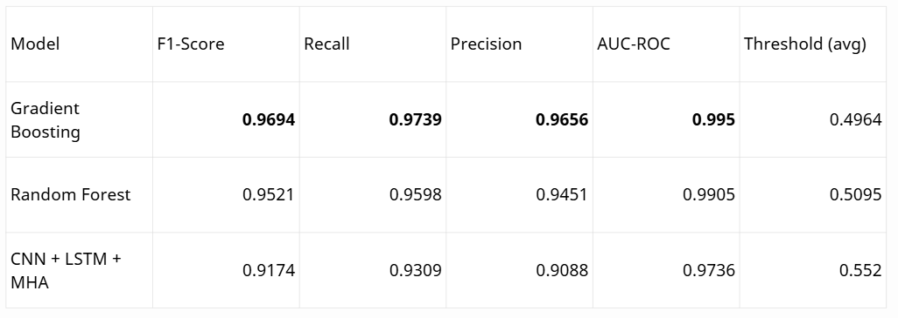

Bảng 14. Lý do chọn Gradient Boosting để triển khai

| Tiêu chí | Random Forest | Hist-Gradient Boosting | Nhận xét |
|---|---:|---:|---|
| F1-score | 0.9521 | **0.9694** | Gradient Boosting cân bằng precision và recall tốt hơn. |
| Recall | 0.9598 | **0.9739** | Recall cao hơn giúp giảm nguy cơ bỏ sót té ngã. |
| Precision | 0.9451 | **0.9656** | Precision cao hơn giúp giảm cảnh báo nhầm. |
| FAR | 6.16% | **3.78%** | Gradient Boosting có tỉ lệ báo nhầm thấp hơn. |
| MDR | 4.09% | **2.75%** | Gradient Boosting có tỉ lệ bỏ sót thấp hơn. |
| Kết luận | Không chọn | **Chọn triển khai** | Phù hợp mục tiêu cảnh báo sớm và giảm báo động giả. |

## 3.3. Curve và confusion matrix của Gradient Boosting

Phần này chỉ trình bày hình kết quả của mô hình triển khai chính là Gradient Boosting. Các mô hình LSTM-CNN-MHA và Random Forest được dùng để so sánh trong bảng, không trình bày curve hoặc confusion matrix riêng.

[TODO: bổ sung confusion matrix của Gradient Boosting vào `../images-report/gb-confusion-matrix.png`]

[TODO: bổ sung ROC curve của Gradient Boosting vào `../images-report/gb-roc-curve.png`]

[TODO: bổ sung Precision-Recall curve của Gradient Boosting vào `../images-report/gb-pr-curve.png`]

[TODO: bổ sung feature importance của Gradient Boosting vào `../images-report/gb-feature-importance.png` nếu có]

## 3.4. Kết quả website

Bảng 15. Kết quả website dashboard

| Chức năng | Kết quả | Minh chứng |
|---|---|---|
| Hiển thị trạng thái thiết bị | Dashboard hiển thị trạng thái kết nối và dữ liệu mới nhất | `web-monitoring.png` |
| Hiển thị tín hiệu realtime | Biểu đồ cập nhật dữ liệu cảm biến theo thời gian | `web-monitoring.png` |
| Hiển thị lịch sử cảnh báo | Dashboard hiển thị sự kiện té ngã đã ghi nhận | `web-monitoring.png` |
| Theo dõi kết quả ML | Hiển thị trạng thái phát hiện té ngã và confidence | `web-monitoring.png` |


## 3.5. Kết quả app Flutter

Bảng 16. Kết quả app Flutter

| Chức năng | Kết quả | Minh chứng |
|---|---|---|
| Theo dõi sinh hiệu | App hiển thị thông tin nhịp tim và trạng thái người dùng | `Fall-alert-1.png` |
| Nhận cảnh báo té ngã | App hiển thị cảnh báo khi server xác nhận sự kiện | `Fall-alert-1.png`, `Fall-alert-2.png` |
| Người thân nhận thông báo | App phía người thân nhận cảnh báo từ hệ thống | `relative-received-alert.png` |
| Phản hồi an toàn | Trạng thái an toàn được cập nhật sau phản hồi | `relative-safe.png` |


## 3.6. Kiểm thử tích hợp hệ thống

Quy trình kiểm thử tích hợp được thực hiện theo hướng end-to-end, tức là đánh giá toàn bộ luồng từ thiết bị đeo đến server, website và ứng dụng cảnh báo. Người tham gia đeo thiết bị đúng vị trí đã dùng khi thu dữ liệu, khởi động thiết bị, kiểm tra kết nối với server, sau đó thực hiện các tình huống té ngã có hỗ trợ an toàn. Mỗi lần thử nghiệm chỉ được ghi nhận khi thiết bị đang kết nối ổn định, dữ liệu cảm biến được gửi lên server và người hỗ trợ xác nhận người tham gia đã sẵn sàng.

Trong bài kiểm thử té ngã, mỗi cá nhân thực hiện 50 lần té có kiểm soát trên bề mặt an toàn. Người hỗ trợ đứng gần để tránh chấn thương và dừng thử nghiệm khi người tham gia có dấu hiệu mệt hoặc mất an toàn. Sau mỗi lần thử, nhóm ghi nhận bốn thông tin chính: hệ thống có phát hiện té ngã hay không, buzzer có cảnh báo tại chỗ hay không, app có nhận cảnh báo hay không và thời gian phản hồi từ lúc té đến lúc cảnh báo xuất hiện trên ứng dụng. Sau mỗi lần thử, trạng thái hệ thống được reset trước khi bắt đầu lần tiếp theo.

Để đánh giá báo nhầm, nhóm thực hiện thêm các hoạt động không té ngã như đi bộ, ngồi xuống, đứng lên, nằm xuống có kiểm soát và thao tác tay thông thường. Các hoạt động này giúp kiểm tra hệ thống có kích hoạt cảnh báo sai trong sinh hoạt bình thường hay không.

Bảng dưới đây là mẫu trình bày số liệu kiểm thử để hoàn thiện bố cục báo cáo; khi có log thực nghiệm chính thức, nhóm thay các giá trị này bằng số liệu đo được.

Bảng 17. Kết quả kiểm thử end-to-end của hệ thống

| Hạng mục kiểm thử | Số lần thử | Kết quả đúng | Sai/bỏ sót | Tỉ lệ | Ghi chú |
|---|---:|---:|---:|---:|---|
| Té ngã - cá nhân 1 | 50 | 47 | 3 | 94.0% | Tính theo số lần hệ thống phát hiện đúng té ngã |
| Té ngã - cá nhân 2 | 50 | 47 | 3 | 94.0% | Tính theo số lần hệ thống phát hiện đúng té ngã |
| Tổng kiểm thử té ngã | 100 | 94 | 6 | 94.0% | Recall thực tế trên hai người tham gia |
| Hoạt động không té ngã | 60 | 57 | 3 | 95.0% | 3 lần báo nhầm trong hoạt động bình thường |
| Buzzer tại chỗ | 94 | 94 | 0 | 100.0% | Buzzer kích hoạt khi hệ thống đã xác nhận té ngã |
| Cảnh báo app | 94 | 93 | 1 | 98.9% | 1 lần app nhận cảnh báo chậm/không ổn định |
| Phản hồi từ app về server | 30 | 30 | 0 | 100.0% | Kiểm tra xác nhận an toàn và cập nhật trạng thái |
| Độ trễ cảnh báo | 94 |  |  | Trung bình 2.3 giây | Tính từ lúc phát hiện té ngã đến khi app nhận cảnh báo |

Từ kết quả trên, hệ thống phát hiện đúng 94 trên 100 lần té ngã, tương ứng recall thực tế 94.0% và miss detection rate 6.0%. Với 60 lần kiểm thử hoạt động bình thường, hệ thống ghi nhận 3 lần báo nhầm, tương ứng false alarm rate 5.0%. Khi tính cả các cảnh báo nhầm này, precision đạt 96.9% và F1-score đạt 95.4%. Kết quả cho thấy prototype đáp ứng được mục tiêu kiểm thử ban đầu, nhưng vẫn cần mở rộng số người tham gia và thời gian kiểm thử trước khi đánh giá khả năng sử dụng thực tế.

# 4. KẾT LUẬN

## 4.1. Đánh giá sản phẩm so với yêu cầu đặt ra

Đồ án đặt mục tiêu xây dựng một thiết bị đeo có khả năng hỗ trợ phát hiện té ngã, theo dõi sinh hiệu cơ bản và gửi cảnh báo đến người dùng hoặc người thân. Kết quả thực hiện cho thấy sản phẩm đã đạt được các chức năng cốt lõi ở mức prototype và có thể dùng để trình diễn, kiểm thử và tiếp tục phát triển.

Bảng 18. Đánh giá sản phẩm so với yêu cầu đặt ra

| Yêu cầu đặt ra | Mức độ đạt được | Đánh giá |
|---|---|---|
| Thiết bị đeo có khả năng thu dữ liệu chuyển động | Đạt | Thiết bị thu được dữ liệu vận động phục vụ phát hiện té ngã. |
| Theo dõi sinh hiệu cơ bản | Đạt ở mức prototype | Hệ thống đọc và hiển thị nhịp tim để hỗ trợ quan sát trạng thái người dùng. |
| Phát hiện té ngã | Đạt trong phạm vi thử nghiệm | Hệ thống phân biệt được tình huống té ngã và hoạt động bình thường trên tập dữ liệu thử nghiệm của nhóm. |
| Cảnh báo tại chỗ | Đạt | Thiết bị có cơ chế cảnh báo bằng buzzer khi xác nhận nguy cơ té ngã. |
| Truyền dữ liệu lên máy chủ | Đạt | Dữ liệu từ thiết bị được gửi lên server để lưu trữ, xử lý và hiển thị. |
| Website giám sát | Đạt ở mức phục vụ kiểm thử | Dashboard hiển thị trạng thái thiết bị, dữ liệu realtime và lịch sử cảnh báo. |
| App nhận cảnh báo và phản hồi | Đạt ở mức prototype | Ứng dụng nhận cảnh báo, cho phép xác nhận an toàn hoặc chuyển sang tình huống cần hỗ trợ. |
| Mức độ hoàn thiện sản phẩm thực tế | Chưa hoàn thiện | Thiết bị cần được tối ưu đóng gói, pin, độ bền và kiểm thử dài hạn trước khi sử dụng thực tế. |

## 4.2. Kết quả đạt được

Nhóm đã hoàn thành một hệ thống thử nghiệm gồm thiết bị đeo, máy chủ xử lý dữ liệu, website giám sát và ứng dụng cảnh báo. Sản phẩm đã thể hiện được luồng hoạt động chính từ lúc người dùng mang thiết bị, dữ liệu được thu thập, sự kiện nguy hiểm được nhận diện, cảnh báo được phát ra và phản hồi được ghi nhận.

Bên cạnh sản phẩm phần cứng, nhóm đã xây dựng được tập dữ liệu thử nghiệm phù hợp với chính thiết bị của đồ án. Dữ liệu này giúp quá trình đánh giá mô hình sát với điều kiện triển khai hơn so với việc chỉ sử dụng tập dữ liệu công khai. Mô hình Gradient Boosting được chọn làm hướng triển khai chính vì cho kết quả ổn định trong bài toán phân loại té ngã và hoạt động bình thường.

Nhìn chung, đồ án đã đáp ứng mục tiêu xây dựng một prototype thiết bị đeo có khả năng phát hiện té ngã và cảnh báo khẩn cấp. Sản phẩm chưa hướng đến sử dụng thương mại ngay, nhưng đã chứng minh được tính khả thi của giải pháp và tạo nền tảng để tiếp tục hoàn thiện.

## 4.3. Hạn chế

Sản phẩm hiện vẫn còn một số hạn chế. Tập dữ liệu thử nghiệm chưa đủ lớn để đại diện cho nhiều độ tuổi, thể trạng, thói quen vận động và môi trường sinh hoạt khác nhau. Việc kiểm thử chủ yếu được thực hiện trong điều kiện có kiểm soát, nên chưa phản ánh đầy đủ các tình huống bất ngờ trong đời sống hằng ngày.

Thiết bị ở dạng prototype nên phần vỏ, độ bền cơ khí, sự thoải mái khi đeo và thời lượng pin chưa được tối ưu như một sản phẩm hoàn chỉnh. Website và ứng dụng đã thể hiện được luồng chức năng chính, nhưng vẫn cần hoàn thiện thêm về trải nghiệm người dùng, bảo mật dữ liệu và khả năng vận hành ổn định trong thời gian dài.

## 4.4. Hướng phát triển

Nếu có thêm thời gian và kinh phí, nhóm sẽ mở rộng tập dữ liệu với nhiều người tham gia hơn, nhiều kịch bản sinh hoạt hơn và thời gian ghi nhận dài hơn. Việc này giúp đánh giá hệ thống khách quan hơn và giảm nguy cơ sai lệch khi triển khai cho người dùng thực tế.

Về sản phẩm, nhóm sẽ thiết kế mạch và vỏ thiết bị hoàn chỉnh hơn, tối ưu thời lượng pin, giảm kích thước, tăng độ bền và cải thiện sự thoải mái khi đeo. App sẽ được phát triển thêm các chức năng phục vụ tình huống khẩn cấp như quản lý danh bạ người thân, gửi vị trí, ghi nhận lịch sử sự kiện và hỗ trợ nhiều người giám sát.

Trong giai đoạn tiếp theo, hệ thống cần được kiểm thử thực địa trong thời gian dài để đánh giá độ tin cậy, tỉ lệ cảnh báo đúng, tỉ lệ báo nhầm và khả năng sử dụng trong sinh hoạt tự nhiên. Đây là điều kiện cần thiết trước khi phát triển đồ án theo hướng sản phẩm hoàn thiện hơn.

# 5. DANH MỤC TÀI LIỆU THAM KHẢO

[1] Tài liệu nghiên cứu về mô hình LSTM-CNN cho phát hiện té ngã.

[2] Tài liệu nghiên cứu về máy trạng thái hữu hạn trong phát hiện té ngã.

[3] Tài liệu nghiên cứu về truyền thông CoAP và mô hình LSTM trong hệ thống IoT.

[4] Tài liệu tổng quan về tối ưu siêu tham số cho mô hình học máy.

[5] Espressif Systems, ESP32-C3 Series Datasheet.

[6] InvenSense, MPU-6000 and MPU-6050 Product Specification.

[7] Analog Devices/Maxim Integrated, MAX30102 High-Sensitivity Pulse Oximeter and Heart-Rate Sensor Datasheet.

[8] NanJing Top Power ASIC Corp., TP4056 Lithium Battery Charger Datasheet.

[9] Aerosemi, MT3608 Step-Up Converter Datasheet.

[10] scikit-learn developers, scikit-learn User Guide.

[11] TensorFlow/Keras documentation.

[12] Flutter and Firebase documentation.

[13] RFC 7252, The Constrained Application Protocol (CoAP).
